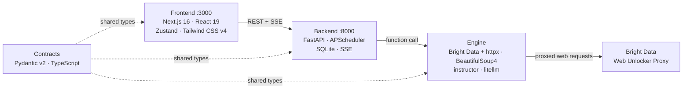

# Market Intelligence Agent

Multi-agent system for the Web Data UNLOCKED hackathon that monitors competitor websites with Bright Data Web Unlocker, extracts structured intelligence with LLMs, verifies claims against source material, and generates reports with full citation chains.

Enter competitor URLs. Get pricing comparisons, feature analysis, team info, and news — every finding linked back to its source with a confidence score.

---

## What It Does

```mermaid
graph TD
    A["Job created\nPOST /api/jobs"] --> BD["Bright Data Web Unlocker\nanti-bot bypass · proxy routing"]
    BD --> B["Scraper"]
    B --> B1["Fetch homepage"]
    B1 --> B2["Discover internal links\npricing · about · blog · jobs"]
    B2 --> B3["Scrape each page\n1s delay between requests"]
    B3 --> C["Analyzer"]
    C --> C1["LLM extracts per page:\npricing · features · team\nnews · claims"]
    C1 --> D["Verifier"]
    D --> D1["Cross-check each claim\nagainst original source text"]
    D1 --> D2["Multi-pass verification\n(default 2 passes)"]
    D2 --> E["Reporter"]
    E --> E1["LLM generates report\nwith findings + comparison tables"]
    E1 --> F["Report delivered\nGET /api/jobs/:id/report"]

    style B fill:#1e3a5f
    style C fill:#1e3a5f
    style D fill:#1e3a5f
    style E fill:#1e3a5f
```



1. **Scraper** routes through Bright Data Web Unlocker when credentials are configured, visits competitor URLs, navigates to key pages (pricing, about, features, blog, jobs), extracts cleaned text
2. **Analyzer** uses LLMs to extract structured claims and data (pricing plans, features, team info, news) from each page
3. **Verifier** cross-checks every claim against the original scraped content in multi-pass verification with confidence scoring
4. **Reporter** synthesizes verified findings into a structured intelligence report with comparison tables and recommendations

Every finding has a verifiable citation chain: claim → source quote → source URL → confidence score.

---

## Features

- **20+ LLM providers** via litellm (OpenAI, Anthropic, Google, Azure, DeepSeek, Mistral, Cohere, Groq, Together AI, Fireworks, Replicate, HuggingFace, Bedrock, xAI, Ollama, Nvidia NIM, Cerebras, SambaNova, Databricks, vLLM, any OpenAI-compatible endpoint)
- **Bright Data Web Unlocker integration** — proxy routing, IP rotation-ready configuration, anti-bot/CAPTCHA detection, provider metadata in SSE events
- **Structured LLM output** via instructor — every LLM call returns validated Pydantic models, never raw text
- **Multi-pass verification** — claims are verified against source material, not just LLM memory
- **Real-time SSE streaming** — watch the pipeline progress in real-time (page scraped, claim verified, report generated)
- **SSRF protection** — blocks private IPs, localhost, metadata endpoints, non-http schemes
- **IP-based rate limiting** — sliding window, configurable per-endpoint limits
- **Scheduled recurring analysis** — APScheduler for "monitor competitor X every 6 hours"
- **SQLite persistence** — jobs and events survive server restarts
- **Job cancellation** — cancel a running pipeline mid-execution
- **Report export** — PDF, JSON, CSV formats
- **Demo mode** — pre-populated Bright Data-backed Notion vs Obsidian comparison on first load
- **Docker Compose** — one-command deployment

---

## Quick Start

### Docker Compose (recommended)

```bash
cp .env.example .env
# Edit .env — set OPENAI_API_KEY / OPENAI_API_BASE and Bright Data credentials

docker-compose up --build

# Frontend: http://localhost:3000
# Backend API: http://localhost:8000
# Health check: http://localhost:8000/api/health
```

### Manual Setup

**Backend (Python 3.11+):**

```bash
uv venv
uv pip install -r backend/requirements.txt -r engine/requirements.txt

export LLM_MODEL=openai/mimo-v2.5-pro
export OPENAI_API_KEY=sk-...
export OPENAI_API_BASE=https://opengateway.gitlawb.com/v1
export BRIGHT_DATA_CUSTOMER_ID=...
export BRIGHT_DATA_ZONE=...
export BRIGHT_DATA_PASSWORD=...
cd backend && uvicorn main:app --host 0.0.0.0 --port 8000
```

**Optional extras:**

```bash
uv pip install -e ".[aws]"   # AWS Bedrock / SageMaker support (boto3 + botocore)
uv pip install -e ".[pdf]"   # PDF report export (reportlab)
```

**Frontend (Node 18+):**

```bash
cd frontend
npm install
NEXT_PUBLIC_API_URL=http://localhost:8000 npm run dev
```

**Engine** runs inside the backend process — no separate start needed. If the engine module can't be imported (missing LLM keys), the backend falls back to a stub that returns mock data.

---

## API Endpoints

| Method | Path | Description |
|--------|------|-------------|
| `GET` | `/api/health` | Liveness probe. Returns scheduler state and version. |
| `POST` | `/api/jobs` | Create analysis job. Body: `CreateJobRequest` with competitor URLs. Returns `job_id`. |
| `GET` | `/api/jobs` | List all jobs with status. |
| `GET` | `/api/jobs/{job_id}` | Get job status (progress, step, counts). |
| `GET` | `/api/jobs/{job_id}/stream` | SSE event stream for real-time pipeline progress. |
| `GET` | `/api/jobs/{job_id}/report` | Get final `IntelligenceReport` for completed jobs. |
| `DELETE` | `/api/jobs/{job_id}` | Cancel a running job. Idempotent for already-cancelled. |
| `POST` | `/api/jobs/{job_id}/export` | Export report as PDF/JSON/CSV. |
| `GET` | `/api/stats` | Dashboard statistics (total jobs, active, findings, etc.). |
| `GET` | `/api/trends` | Job creation trends over time. |
| `GET` | `/api/schedules` | List scheduled recurring jobs. |
| `POST` | `/api/schedules` | Create a scheduled recurring job. |
| `PATCH` | `/api/schedules/{id}` | Update schedule (enable/disable, change frequency). |
| `DELETE` | `/api/schedules/{id}` | Delete a schedule. |

### SSE Event Types

The `/api/jobs/{job_id}/stream` endpoint emits named SSE events:

| Event | When |
|-------|------|
| `job.started` | Pipeline kicked off |
| `step.started` / `step.completed` / `step.failed` | Phase boundaries (scraping, analyzing, verifying, reporting) |
| `page.scraped` | Single page successfully scraped |
| `scraping.complete` | All pages scraped for a competitor |
| `finding.found` | New intelligence claim extracted |
| `comparison.generated` | Comparison table created |
| `claim.verified` / `claim.flagged` | Verification result for a claim |
| `verification.complete` | All verification passes done |
| `report.generated` | Final report ready |
| `job.completed` / `job.failed` / `job.cancelled` | Terminal states |
| `progress` | Progress percentage and current step |
| `log` | General log message |
| `heartbeat` | Keep-alive (every 15s) |

---

## Environment Variables

| Variable | Required | Default | Description |
|----------|----------|---------|-------------|
| `LLM_MODEL` | No | `openai/mimo-v2.5-pro` | Model in litellm format: `provider/model-name` |
| `OPENAI_API_KEY` | Yes for Mimo/OpenAI-compatible | — | API key for the configured LLM endpoint |
| `OPENAI_API_BASE` | Yes for Mimo/OpenAI-compatible | — | OpenAI-compatible base URL such as the Opengateway Gitlawb endpoint |
| `BRIGHT_DATA_CUSTOMER_ID` | Prize eligibility | — | Bright Data customer id for Web Unlocker proxy auth |
| `BRIGHT_DATA_ZONE` | Prize eligibility | — | Bright Data zone name |
| `BRIGHT_DATA_PASSWORD` | Prize eligibility | — | Bright Data zone password |
| `BRIGHT_DATA_COUNTRY` | No | — | Optional country targeting, for example `us` |
| `BRIGHT_DATA_DEBUG` | No | `true` | Adds Bright Data debug suffix and captures debug headers in page metadata |
| `BRIGHT_DATA_CA_CERT` | No | — | Optional path to Bright Data's proxy CA certificate for native proxy TLS verification |
| `BRIGHT_DATA_VERIFY_SSL` | No | `false` | Set to `true` only when the Bright Data CA is trusted by the runtime, or use `BRIGHT_DATA_CA_CERT` |
| `NEXT_PUBLIC_API_URL` | No | `http://localhost:8000` | Backend URL for frontend |
| `BACKEND_HOST` | No | `0.0.0.0` | Backend bind address |
| `BACKEND_PORT` | No | `8000` | Backend port |
| `DATABASE_URL` | No | `sqlite:///./data/market_intel.db` | SQLite path |
| `CORS_ORIGINS` | No | `http://localhost:3000` | Comma-separated allowed origins |

See `.env.example` for the full list of 20+ LLM provider configurations and Bright Data options. If Bright Data credentials are absent, the scraper falls back to direct `httpx` for local development.

Deploy the backend to [Railway](https://railway.app) and the frontend to [Vercel](https://vercel.com). Set `NEXT_PUBLIC_API_URL` on Vercel to the Railway backend URL, and `CORS_ORIGINS` on Railway to the Vercel frontend URL.

---

## Architecture



| Layer | Stack | Directory | Responsibility |
|-------|-------|-----------|----------------|
| **Frontend** | Next.js 16, React 19, Zustand, Tailwind CSS v4, Recharts | `frontend/` | Dashboard UI, SSE streaming, report rendering |
| **Backend** | FastAPI, sse-starlette, APScheduler, aiosqlite | `backend/` | Job management, SSE broadcast, report storage, rate limiting |
| **Engine** | Bright Data Web Unlocker, httpx, BeautifulSoup4, instructor, litellm, tenacity | `engine/` | Scrape, analyze, verify, report pipeline |
| **Contracts** | Pydantic v2, TypeScript | `contracts/` | Shared types across all layers |

---

## Project Structure

```
market-intelligence-agent/
  contracts/
    api.py              API request/response models (CompetitorInput, CreateJobRequest, JobStatusResponse, IntelligenceReport, DashboardStats, ...)
    engine.py           Pipeline models (PipelineContext, ScrapeResult, AnalysisResult, Claim, VerificationResult, ReportOutput, ...)
    events.py           SSE event schemas (EventType enum, AgentEvent model)
    types.ts            TypeScript mirror of all Python models
  backend/
    main.py             FastAPI app factory (create_app), lifespan, router registration
    routes/
      jobs.py           Job CRUD + SSE streaming (POST/GET/DELETE /api/jobs, /stream, /report, /export)
      analytics.py      Dashboard stats and trends (/api/stats, /api/trends)
      schedules.py      Scheduled job CRUD (/api/schedules)
      health.py         Health check (/api/health)
    services/
      job_manager.py    JobRecord + JobManager (in-memory + SQLite, asyncio lock, cancellation)
      event_store.py    EventStore (pub/sub per-job queues, history replay, 500 event cap)
      database.py       SQLite persistence (aiosqlite, jobs/events/schedules tables)
      engine_stub.py    Mock pipeline for development (returns fake data when engine unavailable)
      scheduler.py      APScheduler integration for recurring jobs
      export.py         Report export (PDF/JSON/CSV)
    middleware/
      rate_limit.py     IP-based sliding-window rate limiter (100 general, 10 job creation per minute)
    tests/              34 backend tests
  engine/
    pipeline.py         Pipeline orchestrator (run_pipeline: scrape → analyze → verify → report)
    agents/
      scraper.py        Bright Data Web Unlocker + httpx + BeautifulSoup4 scraper (robots.txt, page classification, content quality scoring)
      analyzer.py       instructor + litellm extraction (5 types: pricing, features, team, news, claims)
      verifier.py       Multi-pass claim verification (exact URL match, 5-tier confidence scoring)
      reporter.py       Report generation via instructor (fallback on LLM failure)
    llm.py              Singleton instructor client wrapping litellm (extract_structured with timeout/retries)
    emitter.py          EventEmitter ABC (abstract interface for event publishing)
    tests/              58 engine tests
  frontend/
    src/
      app/
        page.tsx        Main dashboard page (JobCreator → ProgressConsole → ReportView)
        layout.tsx      Root layout with dark theme
        globals.css     Tailwind config, dark theme variables, glass effects
      components/
        JobCreator      Dynamic competitor URL form with submit
        ProgressConsole  Real-time SSE event log with color-coded events
        ReportView      Intelligence report renderer (summary, findings, tables, recommendations)
        ComparisonTable  Side-by-side competitor comparison
        FindingCard     Individual finding with confidence badge and expandable citations
        StatsCards      Dashboard statistics cards
        TrendsChart     Recharts line chart for job trends
        JobHistory      Past jobs list with status badges
        ScheduleCreator Form for creating recurring schedules
        ScheduleList    List of scheduled jobs with controls
        ui/             shadcn-style primitives (Dialog, Toast, Select, Tabs, etc.)
      stores/
        jobStore.ts     Zustand store (job state, SSE connection, demo mode)
      lib/
        api.ts          API client (all endpoints, typed responses)
        sse.ts          SSE client (EventSource with addEventListener for all event types)
        demoData.ts     Pre-populated Notion vs Obsidian demo data
      types/
        index.ts        Re-exports from contracts/types.ts
    tests/              Frontend tests via vitest
  integration/
    test_adversarial.py  44 security/edge-case tests (SSRF, input validation, rate limiting, idempotency)
    test_contracts.py    Contract compliance tests (Python ↔ TypeScript sync)
    test_e2e.py          End-to-end flow tests
  docs/
    ARCHITECTURE.md      Deep technical architecture (data flow, packages, concurrency model)
    PIPELINE.md          Pipeline deep dive (scrape → analyze → verify → report stages)
    PROVIDERS.md         LLM provider configuration (20+ providers, structured output)
    SECURITY.md          Security model (SSRF defense, rate limiting, input sanitization)
    DEPLOYMENT.md        Deployment guide (Docker, Railway + Vercel, local dev)
    FRONTEND.md          Frontend architecture (state management, SSE, styling, testing)
    API.md               Full API reference (all endpoints, request/response schemas)
  docker-compose.yml     Backend + frontend services with health checks
  Dockerfile.backend     Multi-stage Python build, non-root user
  .env.example           20+ LLM provider configurations
  LICENSE                Apache 2.0
```

---

## Testing

```bash
# All tests
uv run python -m pytest backend/tests -q
uv run python -m pytest engine/tests -q
uv run python -m pytest integration -q
cd frontend && npm test

# Specific suite
cd backend && python -m pytest tests/test_jobs.py -v
cd engine && python -m pytest tests/test_verifier.py -v
cd integration && python -m pytest test_adversarial.py -v
```

Total: 430+ tests across all suites.

---

## Deep Dive

For detailed technical documentation:

- **[Architecture](docs/ARCHITECTURE.md)** — System overview, package structure, data flow, event architecture, concurrency model, LLM integration
- **[Pipeline](docs/PIPELINE.md)** — Four-stage pipeline deep dive: scraping, analysis, verification, report generation, cancellation, error handling
- **[Providers](docs/PROVIDERS.md)** — 20+ LLM provider configurations, litellm routing, instructor structured output, extraction models
- **[Security](docs/SECURITY.md)** — Multi-layer SSRF defense, rate limiting, input sanitization, export security, CORS, error sanitization
- **[Deployment](docs/DEPLOYMENT.md)** — Docker Compose, Railway + Vercel, local development, CI/CD, SQLite considerations, scaling
- **[Frontend](docs/FRONTEND.md)** — React 19 + Next.js 16 architecture, Zustand state, SSE client, styling, testing
- **[API Reference](docs/API.md)** — All endpoints with request/response schemas, SSE events, rate limiting headers

---

## License

Apache 2.0
