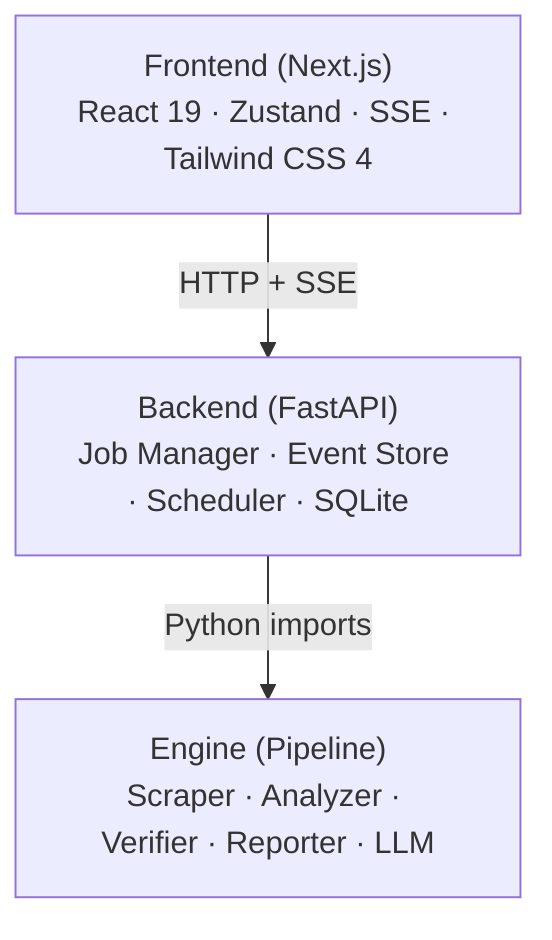
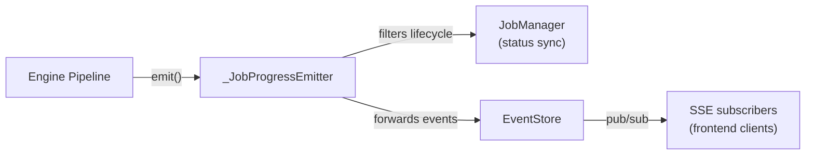
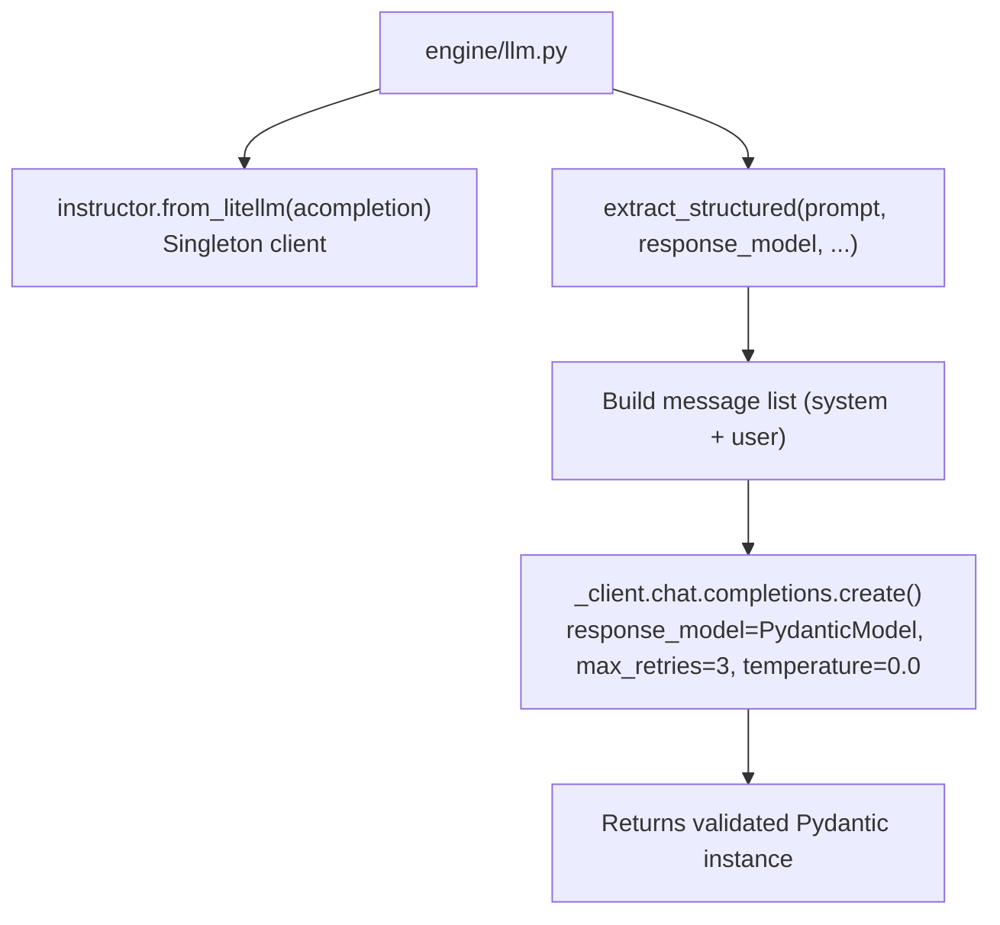

# Architecture

## System Overview

The Market Intelligence Agent is a multi-agent system that scrapes, analyzes, verifies, and reports on competitor intelligence. It consists of three layers:



## Package Structure

```
market-intelligence-agent/
├── contracts/          # Shared Pydantic models (API, Engine, Events)
├── engine/             # Pipeline + agent implementations
│   ├── agents/         # scraper, analyzer, verifier, reporter
│   ├── llm.py          # litellm + instructor wrapper
│   ├── pipeline.py     # Orchestrator (scrape → analyze → verify → report)
│   └── emitter.py      # Abstract event emitter interface
├── backend/            # FastAPI application
│   ├── routes/         # jobs, health, analytics, schedules
│   ├── services/       # database, event_store, job_manager, scheduler, export
│   └── middleware/     # rate_limit
├── frontend/           # Next.js 16 + React 19
│   └── src/
│       ├── app/        # Pages (dashboard, report/[jobId])
│       ├── components/ # UI components
│       ├── stores/     # Zustand state management
│       ├── lib/        # API client, SSE client, utils
│       └── types/      # TypeScript type definitions
└── integration/        # E2E and adversarial tests
```

## Data Flow

### Job Lifecycle

```
1. User submits CreateJobRequest via POST /api/jobs
2. Backend creates JobRecord in SQLite + in-memory cache
3. Background task starts: _run_job_background()
4. Pipeline runs: scrape → analyze → verify → report
5. Each step emits AgentEvents via EventEmitter
6. Events stored in EventStore (in-memory) + forwarded as SSE
7. Frontend receives events via EventSource, updates UI in real-time
8. On completion, ReportOutput converted to IntelligenceReport, saved to DB
```

### Event Architecture



The `_JobProgressEmitter` wraps the `EventStore` and:
1. Syncs job state (status, progress, page/finding counts) to `JobManager`
2. Filters out lifecycle events (`JOB_STARTED`, `JOB_COMPLETED`, etc.) since those are published directly by `_run_job_background`
3. Forwards all other events to the `EventStore` for SSE delivery

### SSE Reconnection

The `EventStore` maintains per-job event history (capped at 500 events). When a client reconnects with `Last-Event-Id`, it replays missed events from history before streaming live events.

## Contracts Layer

The `contracts/` package defines all shared Pydantic models:

| Module | Purpose | Consumers |
|--------|---------|-----------|
| `contracts/api` | API request/response models | Backend routes, Frontend types |
| `contracts/engine` | Pipeline internal models | Engine agents, Pipeline |
| `contracts/events` | SSE event schemas | Engine emitter, EventStore, Frontend |

This separation ensures the engine never imports backend code, and the backend never imports engine internals directly — only through the contracts.

## Database Schema

SQLite with WAL mode for concurrent reads:

```sql
-- Jobs table: one row per analysis job
jobs (id, status, progress, current_step, competitors_found,
      pages_scraped, findings_count, started_at, completed_at,
      error, report_json, request_json, created_at)

-- Events table: append-only log of all pipeline events
events (id, job_id, event_type, agent_name, timestamp,
        message, data_json, sequence)

-- Schedules table: recurring job configurations
schedules (id, job_id, request_json, frequency, cron_expression,
           next_run, last_run, last_job_id, enabled, created_at)
```

The `report_json` column stores the full `IntelligenceReport` as serialized JSON. This is denormalized but avoids a separate reports table for this scale.

## Concurrency Model

- **asyncio.Lock** on `JobManager` protects all job state mutations
- **asyncio.Lock** on `EventStore` protects subscriber list and history
- **asyncio.Semaphore(5)** on verifier limits concurrent LLM calls
- **asyncio.Lock** on `Database._seq_lock` ensures monotonic event sequence numbers
- **No lock** on `JobManager.is_cancelled()` — `set.__contains__` is thread-safe in CPython

## LLM Integration



Instructor handles:
1. Converting the Pydantic schema to tool/function definitions
2. Sending them to the LLM via litellm
3. Parsing the response into the Pydantic model
4. Retrying on validation failures (up to `max_retries` times)

litellm handles:
1. Routing to the correct provider based on model prefix (e.g., `openai/`, `anthropic/`)
2. Provider-specific API key resolution from environment variables
3. Timeout and error handling
