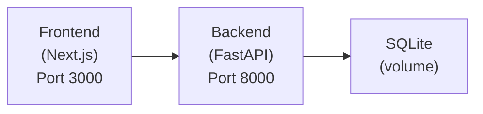
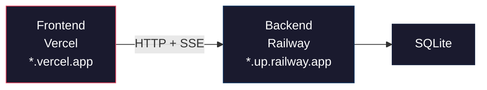

# Deployment Guide

## Quick Start (Docker Compose)

```bash
# 1. Clone and configure
cp .env.example .env
# Edit .env with your API keys

# 2. Start services
docker compose up -d --build

# 3. Access
# Frontend: http://localhost:3000
# Backend API: http://localhost:8000
# Health check: http://localhost:8000/api/health
```

## Architecture



## Docker

### Backend (`Dockerfile.backend`)
- Multi-stage build (builder + runtime)
- Python 3.11-slim base
- Non-root user (`appuser`)
- Health check via `urllib.request`
- Uses `uv export` for dependency installation

### Frontend (`Dockerfile.frontend`)
- Multi-stage build (builder + runner)
- Node 20-slim base
- Next.js standalone output
- Non-root user (`nextjs`)
- Health check via `fetch()`

## Production Deployment (Railway + Vercel)

The backend requires a long-running server (SSE streaming, background pipeline tasks, in-memory event store), so it runs on **Railway**. The frontend is a standard Next.js app deployed to **Vercel** (free, zero-config).



### Backend → Railway

1. Sign in at [railway.app](https://railway.app) with GitHub
2. **New Project → Deploy from GitHub repo**
3. Railway auto-detects `Dockerfile.backend`
4. Set `PORT` = `8000`
5. Add env vars (see [Environment Variables](#environment-variables) below)
6. **Settings → Networking → Generate Domain** to get your public URL
7. Set `CORS_ORIGINS` to your Vercel frontend URL

### Frontend → Vercel

1. Sign in at [vercel.com](https://vercel.com) with GitHub
2. **Import** the same repo
3. Set **Root Directory** → `frontend`
4. Add one env var: `NEXT_PUBLIC_API_URL` = your Railway backend URL
5. Deploy — Vercel auto-detects Next.js

## Environment Variables

### Required
| Variable | Description |
|----------|-------------|
| `LLM_MODEL` | Model identifier (e.g., `openai/mimo-v2.5-pro`) |
| `OPENAI_API_KEY` | API key for the selected provider |

### Optional — Engine
| Variable | Default | Description |
|----------|---------|-------------|
| `MAX_PAGES_PER_COMPETITOR` | `20` | Max pages to scrape per competitor |
| `VERIFICATION_PASSES` | `2` | Multi-pass verification count |
| `REQUEST_DELAY_SECONDS` | `1.0` | Delay between scrape requests |
| `LLM_TIMEOUT_SECONDS` | `60` | Per-LLM-call timeout |
| `MAX_CONCURRENT_JOBS` | `5` | Max parallel analysis jobs |
| `MAX_COMPETITORS_PER_JOB` | `10` | Max competitors per job |
| `PIPELINE_TIMEOUT_SECONDS` | `600` | Per-job pipeline timeout (0 = no timeout) |
| `LLM_RPM` | `10` | Rate limit for sequential LLM calls (requests per minute) |
| `MIN_PAGE_QUALITY` | `0.5` | Minimum page quality score to send to LLM (0.0-1.0) |
| `LITELLM_DEBUG` | `false` | Enable verbose litellm logging |
| `IGNORE_ROBOTS_TXT` | `true` | Skip robots.txt checks |

### Optional — Bright Data
| Variable | Description |
|----------|-------------|
| `BRIGHT_DATA_CUSTOMER_ID` | Bright Data customer ID |
| `BRIGHT_DATA_ZONE` | Web Unlocker zone name |
| `BRIGHT_DATA_PASSWORD` | Zone password |
| `BRIGHT_DATA_COUNTRY` | Country code for geo-targeting |
| `BRIGHT_DATA_DEBUG` | Enable debug headers (`true`/`false`) |

### Optional — Backend
| Variable | Default | Description |
|----------|---------|-------------|
| `DATABASE_URL` | `sqlite:///./data/market_intel.db` | Database connection string |
| `CORS_ORIGINS` | `http://localhost:3000,...` | Comma-separated allowed origins |
| `TRUSTED_PROXIES` | (empty) | Comma-separated proxy IPs for X-Forwarded-For trust |
| `LOG_LEVEL` | `INFO` | Logging level |

## Local Development

```bash
# Install dependencies
make install

# Start backend (with auto-reload)
make dev-backend

# Start frontend (with auto-reload)
make dev-frontend

# Run tests
make test

# Run linters
make lint
```

## CI/CD

GitHub Actions (`.github/workflows/ci.yml`):

1. **backend-tests** — Python 3.11, runs backend + engine tests
2. **frontend-build** — Node 20, builds frontend
3. **integration-tests** — Runs after backend + frontend pass
4. **docker-build** — Builds both Docker images, verifies backend starts

## SQLite Considerations

- WAL mode enabled for concurrent reads
- 30-second busy timeout
- Data persisted to `/app/data/` in Docker (volume mount)
- For production with high concurrency, consider migrating to PostgreSQL

## Scaling

The current architecture is single-process:
- One FastAPI worker handles all requests
- Pipeline runs as background asyncio tasks
- SQLite limits concurrent writes

For higher scale:
1. Use Gunicorn with multiple Uvicorn workers
2. Migrate to PostgreSQL for concurrent write support
3. Use Redis for event pub/sub instead of in-memory EventStore
4. Add Celery for background task processing
