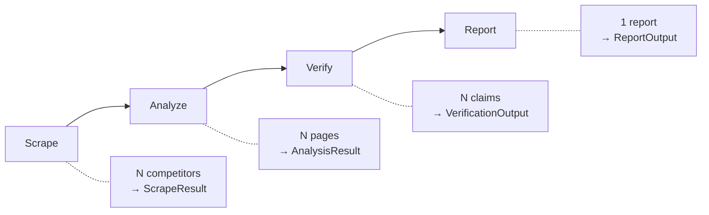

# Pipeline Deep Dive

## Pipeline Stages

The pipeline in `engine/pipeline.py` runs four sequential stages:

### Stage 1: Scrape (`engine/agents/scraper.py`)

For each competitor URL:

1. **robots.txt check** — Fetches and parses `robots.txt`. Respects `Disallow` rules.
2. **Homepage fetch** — Downloads the homepage with random User-Agent rotation.
3. **Anti-bot detection** — Checks for Cloudflare challenges, CAPTCHAs, and HTTP 403/429.
4. **Content parsing** — Single-pass BeautifulSoup parse extracts:
   - Clean text (strips scripts, styles, nav, footer, header)
   - Page title from `<title>` tag
   - Metadata (description, og:image, canonical URL)
   - Internal links (same-domain only)
5. **Link prioritization** — Links scored by relevance to focus areas (pricing, features, team, news). Priority pages are fetched first.
6. **Content classification** — Each page classified by URL patterns and content keyword analysis for link prioritization and quality scoring.
7. **Quality scoring** — Pages scored 0.0–1.0 based on word count, keyword density, and boilerplate detection.
8. **Deduplication** — Content hashed (SHA-256 of normalized text). Duplicate pages skipped.
9. **Rate limiting** — Configurable delay between requests (`REQUEST_DELAY_SECONDS`).

**Bright Data Integration:** When `BRIGHT_DATA_CUSTOMER_ID`, `BRIGHT_DATA_ZONE`, and `BRIGHT_DATA_PASSWORD` are all set, traffic is routed through Bright Data's Web Unlocker proxy. This bypasses Cloudflare, CAPTCHAs, and other anti-bot measures.

**SSRF Defense:** URLs are validated at job creation time (DNS resolution, private IP blocking). Before fetching, DNS is re-resolved and IPs are re-checked to close the TOCTOU window. Redirect targets are also validated after each redirect hop.

### Stage 2: Analyze (`engine/agents/analyzer.py`)

Hybrid architecture: heuristic classification + single LLM extraction.

**Pass 1 — Classify (free, no LLM):**
Python heuristics classify each page using URL patterns (e.g. `/pricing` → pricing) and content keyword matching. Pages classified as pricing, features, team, news, blog, docs, etc. Low-quality pages (below `MIN_PAGE_QUALITY`, default 0.5) and anti-bot pages are skipped entirely.

**Pass 2 — Extract (1 LLM call per page):**
A single unified `_PageAnalysis` model extracts ALL data types in one call:

| Data type | Fields |
|-----------|--------|
| Pricing | Plans, prices, billing periods, free tier, enterprise pricing |
| Features | Name, description, category, differentiators, limitations |
| Team | Size, key members, recent hires, funding/growth indicators |
| News | Announcements, product launches, partnerships |
| Claims | Verifiable factual statements with exact source quotes |

Sequential execution with RPM throttle (`LLM_RPM`, default 10). Each call returns a validated Pydantic model via instructor or raw httpx (for OpenAI-compatible endpoints).

**Claim generation** — Each claim includes factual statement, category, exact source quote, source URL.

**Aggregation** — Results merged across all pages. First pricing/team data wins (no overwriting).

### Stage 3: Verify (`engine/agents/verifier.py`)

Multi-pass verification against source text:

**Pass 1:** All claims verified concurrently (Semaphore(5) limits parallelism).

**Passes 2+:** Re-checks flagged claims (unverified or confidence < 0.6).

For each claim:
1. Source text located by matching `claim.source_url` to scraped pages.
2. LLM evaluates: exact match, semantic match, context preservation, temporal accuracy, specificity.
3. Quote validation: if LLM says verified but the supporting quote isn't found in the source text, the claim is downgraded to unverified with confidence capped at 0.49.
4. Conservative bias: LLM is instructed to prefer flagging over false verification.

**Confidence levels:**
- 0.9–1.0: Directly stated with exact quote
- 0.7–0.9: Clearly implied
- 0.5–0.7: Partially supported
- 0.3–0.5: Weakly supported
- 0.0–0.3: Unsupported or contradicted

### Stage 4: Report (`engine/agents/reporter.py`)

Generates the final `ReportOutput`:

1. **Analysis summary** — Aggregated pricing, features, team, news, and claims per competitor.
2. **Verification summary** — Verified vs flagged counts, supporting quotes, concerns.
3. **LLM report generation** — Structured extraction into `_ReportDraft`:
   - Executive summary (2–3 paragraphs)
   - Findings (each with title, summary, category, confidence, citations, impact, recommendation)
   - Comparison tables (pricing, features, market position)
   - Trend analysis
   - Recommendations (immediate, short-term, strategic)
4. **Fallback** — If LLM fails, generates a fallback report from verified claims (or all claims if verification also failed).

## Cancellation

Cancellation is cooperative. The `cancelled_check` callable is checked at multiple points:
- Before scraping each competitor
- Before each page fetch
- Before analysis
- Before verification
- Before report generation

When cancelled, `_partial_report()` builds a report from whatever data was collected so far, and emits `JOB_CANCELLED`.

## Error Handling

Each stage has try/except blocks. Failures in individual competitors/pages don't crash the pipeline:
- Scraping failure for one competitor → continues with others, emits `STEP_FAILED`
- Analysis failure for one competitor → continues with others, emits `STEP_FAILED`
- Verification failure → falls back to all claims unverified
- Report generation failure → returns fallback report from claims

Only if ALL competitors fail at a stage does the pipeline emit `JOB_FAILED`.
